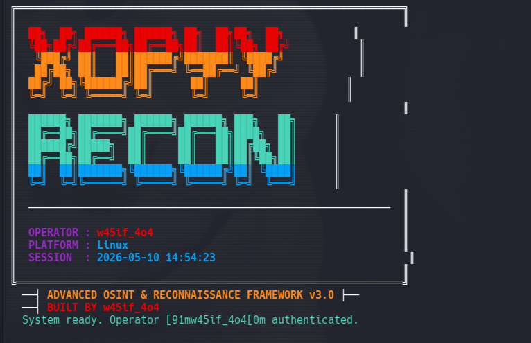
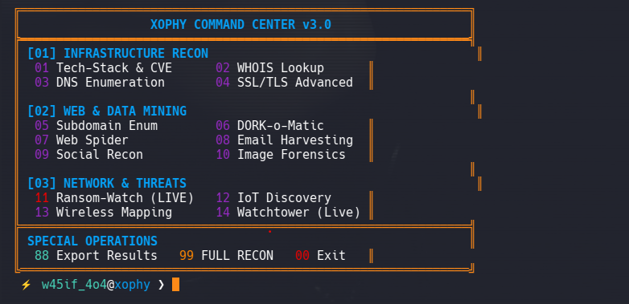

# XOPHY 🔍



## Advanced OSINT & Infrastructure Intelligence Tool
XOPHY is a next-generation reconnaissance framework designed for **ethical OSINT, infrastructure analysis, and security research**.

### Interface Preview


---

## 🚀 Features

### [01] Infrastructure Recon
* **Tech-Stack & CVE:** Identify server technologies and vulnerabilities.
* **DNS Enumeration:** Full MX, TXT, and A record mapping.
* **SSL/TLS Advanced:** Deep analysis of certificate security.

### [02] Web & Data Mining
* **DORK-o-Matic:** Automated Google Dorking for sensitive data.
* **Subdomain Enum:** Find hidden entry points and sub-assets.
* **Social Recon:** Deep search across social media footprints.

### [03] Network & Threats
* **Ransom-Watch (LIVE):** Track active ransomware threats and leaks.
* **IoT Discovery:** Locate connected devices and industrial assets.
* **Watchtower (Live):** Real-time monitoring of target infrastructure.

---

## 📦 Installation

```bash
## Installation
git clone https://github.com/w4sif404/xophy
cd xophy
chmod +x install.sh && ./install.sh

## Usage
python3 core/cli.py
